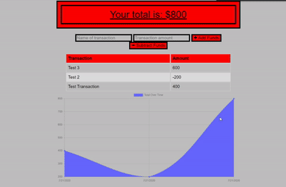

# Progressive-Budget

**To see this site live on Heroku, click [here]().**

## **Table of Contents**

* Project Description
* Assignment Instructions
* Assignment Requirements
* Project Objective
* Usage
* Licence
* Contributors
* Installation
* Tests
* Video of Deployed Application

## ❔ **Description**

This application is a user-focused budget tracker.

## 💡 **Assignment Instructions**

- [x] Add functionality to our existing Budget Tracker application to allow for offline access and functionality.

- [x] The user will be able to add expenses and deposits to their budget with or without a connection. When entering transactions offline, they should populate the total when brought back online.

Offline Functionality:

  * - [x] Enter deposits offline

  * - [x] Enter expenses offline

When brought back online:

  * - [x] Offline entries should be added to tracker.

## 📌 **Assignment Requirements**

GIVEN a user is on Budget App without an internet connection
WHEN the user inputs a withdrawal or deposit
THEN that will be shown on the page, and added to their transaction history when their connection is back online. 

## 🔲 **Objective**

Giving users a fast and easy way to track their money is important, but allowing them to access that information anytime is even more important. 
Having offline functionality is paramount to our applications success.

## 🔑 **Usage**

AS AN avid traveller
I WANT to be able to track my withdrawals and deposits with or without a data/internet connection
SO THAT my account balance is accurate when I am traveling

## © **Licence**

MIT License. See LICENSE file for more information.

## 💬 **Contributors**

This was a solo project for a UofU Coding Bootcamp, but credit must also be noted for my instructor and TA's, as well as the author of our class curriculum and our SSM. 

## 🔒 **Installation**

Run npm i in your terminal to retrieve necessary node modules. 

Please do not clone this repo. 

## 📂 **Tests**

There are currently no tests for this app. 

## **Video of Deployed Application**

